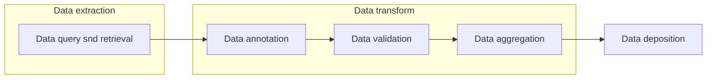

# ETL tools

# Main Objectives
This recipe extracts common ETL workflow based on real life expereinces in pharma or academia and identifies tools for common ETL process. It aims to support people to learn about this topic, provide a way to start and some guidance on implementation.

Data Extraction, transformation, and loading (ETL) is the process of collecting data from one source to a desinated system in which the data is represented differently.[1]

One common use case in biological science is to build scaleble and portable ETL system to extract data from different sources, transform data into a cohesive dataset, and load data to internal or public database to support data exchange.

Two types of tool lists are provided in this recipe. Manual collected. and automatedly discovered.

# Graphical Overview of the FAIRification Recipe Objectives
The figure below shows an example ETL workflow.

>Disclaimer: The tools list below aims to provide a idea of what is there on the market. It's not a formal recommendation. if you think there are tools that need to be updated, please contact us via the github issue.

## Steps

### Data extraction/ Query and retrieval
The process of extracting structured or unstructured data from different sources. The process of identifying and obtaining data from data management systems.

- Manual curated list
    |Tool|Description|Topics|Type|License|
    |--|--|--|--|--|
    |TAMR|A commercial tool for information extraction|
    |Bert|For information extraction|
    |...|...|

- Auto discovered tools in BioTools
_Content in this table are generated on Feb 2021, for updated contents, please follow this link._

    |Tool|Description|Topics|
    |--|--|--|
    |bridgedbr|Use BridgeDb functions and load identifier mapping databases in R.|
    |identifiers.org|Resolver of URIs.|
    |...|...|

### Data transformation
The process of converting the data format, structure, and value to meet specific data standards.

#### Data annotation
The process of labeling data or metadata.

- Manual curated list
    |Tool|Description|Topics|Type|License|
    |--|--|--|--|--|
    |SDTM|A commercial software for data parsing|
    |Dublin Core|Metadata management|
    |...|...|
    
   
- Auto discovered tools in BioTools
_Content in this table are generated on Feb 2021, for updated contents, please follow this link._

     |Tool|Description|Topics|Type|License|
    |--|--|--|--|--|
    |TAMR|A commercial tool for information extraction|
    |Bert|For information extraction|
    |...|...|

#### Data validation
The process of ensuring data has met data standards both in terms of data content and data format.

#### Data aggregation
The process of gathering data and presenting it in a summarized format.
- Manual curated list
    |Tool|Description|Topics|Type|License|
    |--|--|--|--|--|
    |TriFacta|A commercial tool for data quality managment|
    |...|...|
    
   
- Auto discovered tools in BioTools
_Content in this table are generated on Feb 2021, for updated contents, please follow this link._

     |Tool|Description|Topics|Type|License|
    |--|--|--|--|--|
    |TAMR|A commercial tool for information extraction|
    |Bert|For information extraction|
    |...|...|

### Data deposition
- Manual curated list
    |Tool|Description|Topics|Type|License|
    |--|--|--|--|--|
    |Informatica|information extraction, cloud migration|
    |REDCap|...|
    |TransMART|data storage, clinical data|
    |Collibra|data catalog, schema validation, governance, entity versioning|
    
   
- Auto discovered tools in BioTools
_Content in this table are generated on Feb 2021, for updated contents, please follow this link._

     |Tool|Description|Topics|Type|License|
    |--|--|--|--|--|
    |TAMR|A commercial tool for information extraction|
    |Bert|For information extraction|
    |...|...|

### Example use case: 
To show how these tools can be used in real life examples, please check the related recipes.
1. OMOP ETL [link]()
2. FASTQ file validation [link]()

# References: 
1. https://en.wikipedia.org/wiki/Extract,_transform,_load

