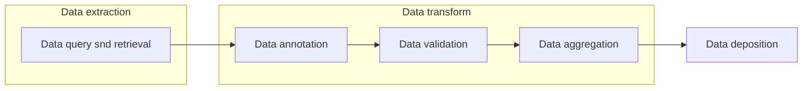

# Tools for Data Extraction, transformation, and loading

# Main Objectives
This recipe identifies tools for data extraction, transformation, and loading (ETL). ETL is the process of collecting data from one source to a designated system in which the data is represented differently.[1] One common use case in biological science is to build a scalable and portable ETL system to extract data from different sources, transform data into a cohesive dataset, and load data to an internal or public database to support data exchange.

>The lists of tools in this document are generated either by manual curation, which reflects what is being used in the industry or discovered automatically from bio.tools repository.Instead of providing comprehensive lists covering all types of tools, we aim to provide some tools as examples to allow people to start the exploration.
>
>_Contents in this table are generated in March 2021, for updated contents, please check the [FAIR tooling repository]()._

# Graphical Overview of the FAIRification Recipe Objectives
The figure below shows an example ETL workflow.

<table>
  <tr>
   <td><strong>Data query and retrieval</strong>
   </td>
   <td><strong>Data transformation</strong>
   </td>
   <td><strong>Data deposition</strong>
   </td>
  </tr>
  <tr>
   <td><a href="https://www.tamr.com/">TAMR</a>
   </td>
   <td><a href="https://www.cdisc.org/standards/foundational/sdtm">SDTM</a>
   </td>
   <td><a href="https://www.project-redcap.org/">REDCap</a>
   </td>
  </tr>
  <tr>
   <td><a href="https://github.com/google-research/bert">Bert</a>
   </td>
   <td><a href="https://www.trifacta.com">TriFacta</a>
   </td>
   <td><a href="https://github.com/transmart">TransMART</a>
   </td>
  </tr>
  <tr>
   <td><a href="https://www.scibite.com/platform/termite/">Termite</a>
   </td>
   <td><a href="https://www.ohdsi.org/data-standardization/the-common-data-model/">OMOP</a>
   </td>
   <td><a href="https://www.stardog.com/">Stardog</a>
   </td>
  </tr>
  <tr>
   <td><a href="https://www.oracle.com/uk/industries/life-sciences/clinical-research/">Oracle clinical</a>
   </td>
   <td><a href="https://www.collibra.com/">Collibra</a>
   </td>
   <td><a href="https://www.postgresql.org/">Postgresql</a>
   </td>
  </tr>
  <tr>
   <td>
   </td>
   <td><a href="https://hadoop.apache.org/">Apache Hadoop</a>
   </td>
   <td>
   </td>
  </tr>
  <tr>
   <td>
   </td>
   <td><a href="https://www.talend.com/products/integrate-data/">Talend</a>
   </td>
   <td>
   </td>
  </tr>
  <tr>
   <td>
   </td>
   <td><a href="https://www.informatica.com/">Informatica</a>
   </td>
   <td>
   </td>
  </tr>
</table>
>Disclaimer: The tools list below aims to provide a idea of what is there on the market. It's not a formal recommendation. if you think there are tools that need to be updated, please contact us via the github issue.

## Operations

### Data query and retrieval
The process of extracting structured or unstructured data from different sources. The process of identifying and obtaining data from data management systems.

__Manual curated list__
|Tool|Description|License|Topics|Platform|
|---|--|--|--|--|
|[TAMR](https://www.tamr.com/)|A cloud-native data mastering solution (cloud MDM) accelerate analytics through machine learning (ML), available on Google Cloud, Azure and AWS.|Commercial license|information integration, data unification|
|[Bert](https://github.com/google-research/bert)|Bidirectional Encoder Representations from Transformers (BERT) is a Transformer-based machine learning technique for natural language processing (NLP) pre-training developed by Google, aiming to extractcontext-sensitive features from an input text.  |Apache License 2.0|relationship extraction|Data model|
|[Termite](https://www.scibite.com/platform/termite/)|TERMite (TERM identification, tagging & extraction) is a fast named entity recognition (NER) and extraction engine for semantic analytics.|Commercial license|information extraction|
|[Oracle clinical](https://www.oracle.com/uk/industries/life-sciences/clinical-research/)|a single application and infrastructure for electronic data capture and clinical data management, while leveraging the renowned Oracle database. Oracle Clinical enables management of all clinical trial data in a single system, improving accuracy, visibility, and data integrity.|Commercial license|Clinical data|

Auto discovered tools in BioTools
_Content in this table are generated on Feb 2021, for updated contents, please check the FAIR tooling repo._

|Tool|Description|License|Topics|Platform|
|---|--|--|--|--|

### Data transformation
The process of converting the data format, structure, and value to meet specific data standards. Below are some common operations in data transformation.
- Data annotation
    The process of labeling data or metadata.
- Data validation
    The process of ensuring data has met data standards both in terms of data content and data format.
- Data aggregation
    The process of gathering data and presenting it, usually,  in a summarized format.

__Manual curated list__
|Tool|Description|License|Topics|Platform|
|---|--|--|--|--|
|[SDTM](https://www.cdisc.org/standards/foundational/sdtm)|SDTM provides a standard for organizing and formatting data to streamline processes in collection management analysis and reporting.|N/A|data aggregation, data warehousing, Standard for Exchange of Non-clinical Data|Data standard
|[TriFacta](https://www.trifacta.com)|A data preparation tool for data quality improvement, data transformation, and building data pipelines.|Commercial license|
|[OMOP](https://www.ohdsi.org/data-standardization/the-common-data-model/)|The OMOP Common Data Model allows for the systematic analysis of disparate observational databases.|N/A|Data transformation|Data model|
|[Collibra](https://www.collibra.com/)|an enterprise-oriented data governance platform that provides tools for data management and stewardship.|Commercial License|Data catalogue,data governance, data linkage|
|[Apache Hadoop](https://hadoop.apache.org/)|A framework that allows for the distributed processing of large data sets across clusters of computers using simple programming models. It is designed to scale up from single servers to thousands of machines|[Apache License 2.0](http://www.apache.org/licenses/LICENSE-2.0)|Distributed computing|
|[Talend](https://www.talend.com/products/integrate-data/)|A unified approach that combines rapid data integration, transformation, and mapping with automated quality checks to ensure trustworthy data in every step.|Commercial tools|Data integration|
|[Informatica](https://www.informatica.com/)|Connect & fetch data from different heterogeneous source and processing of data.|Commercial License|Data integration|

  
__Auto discovered tools in BioTools__
_Content in this table are generated on Feb 2021, for updated contents, please follow this link._

|Tool|Description|License|Topics|Platform|
|---|--|--|--|--|

### Data deposition
The process of loading data to hosting (end) destinations, such as public data archives and data warehouses.

|Tool|Description|License|Topics|Platform|
|---|--|--|--|--|
|[REDCap](https://www.project-redcap.org/)|REDCap is a secure web application for building and managing online surveys and databases. While REDCap can be used to collect virtually any type of data in any environment|[REDCap License Terms](https://projectredcap.org/partners/termsofuse/)|Cloud migration|Web application|
|[TransMART](https://github.com/transmart)|An open-source data warehouse designed to store large amounts of clinical data from clinical trials, as well as data from basic research|[GPL-3.0 License](https://github.com/transmart/transmartApp/blob/master/LICENSE.TXT)|Data storage, clinical data|
|[Stardog](https://www.stardog.com/)|Triple Store Database, Provide an enterprise knowledge graph as FAIR+ data catalogue|Commercial license|Data integration,data catalog|
|[Postgresql](https://www.postgresql.org/)|A free and open-source relational database management system (RDBMS) emphasizing extensibility and SQL compliance.|[The PostgreSQL Licence](https://www.postgresql.org/about/licence/)|Relational database|

__Auto discovered tools in BioTools__
_Content in this table are generated on Feb 2021, for updated contents, please follow this link._

|Tool|Description|License|Topics|Platform|
|---|--|--|--|--|

### Example use case: 
To show how these tools can be used in real life examples, please check the related recipes.
1. OMOP ETL [link]()
2. FASTQ file validation [link]()

# References: 
1. https://en.wikipedia.org/wiki/Extract,_transform,_load

