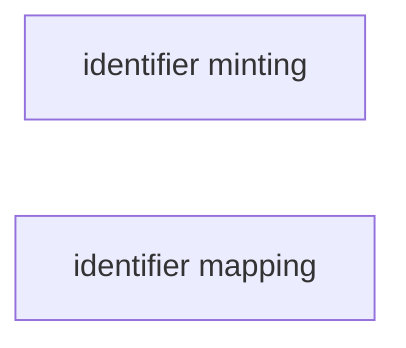

# Tools for identifier minting and identifier mapping.

# Main Objectives
This recipe identifies tools for creating identifiers and aligning identifiers used in different systems. 

>The lists of tools are generated either by manual curation, which reflects what is being used in the industry, or automatally discovered from the bio.tools repository.
>
>:bulb: Contents in this table are generated in March 2021. For updated contents, please check the FAIR tooling repository. You can provide feedback or report issues in the comments section.

# Graphical Overview of the FAIRification Recipe Objectives
The figure below shows different identifier-related operations and their relationships, together with related tools and recipes.

The table below is an overview of ontology strategies tools identified. Details of each tools are also provided in this doc.

<table>
  <tr>
   <td><strong>Identifier mapping</strong>
   </td>
  </tr>
  <tr>
   <td><a href="https://bio.tools/ah-db">ah-db</a>
   </td>
  </tr>
  <tr>
   <td><a href="https://bio.tools/bridgedb">bridgedb</a>
   </td>
  </tr>
  <tr>
   <td><a href="https://bio.tools/idmappinganalysis">idmappinganalysis</a>
   </td>
  </tr>
  <tr>
   <td><a href="https://bio.tools/idmappingretrieval">idmappingretrieval</a>
   </td>
  </tr>
  <tr>
   <td><a href="https://bio.tools/organism.dplyr">organism.dplyr</a>
   </td>
  </tr>
</table>
   
>Disclaimer: The tools list below aims to provide a idea of what is there on the market. It's not a formal recommendation. if you think there are tools that need to be updated, please contact us via the github issue.

## Operations

<h3 id=identifier-mapping>Identifier mapping</h3>
The process of mapping or translating identifiers from one database or system to another.

__Manually curated tools__ 
|Tool|Description|License|Topics|Resource type|
|---|--|--|--|--|
||||| 

__Tools discovered from [Bio.Tools](https://bio.tools).__
<table>
  <tr>
   <td><strong>Tool</strong>
   </td>
   <td><strong>Description</strong>
   </td>
   <td><strong>License</strong>
   </td>
   <td><strong>Topics</strong>
   </td>
   <td><strong>ResourceType</strong>
   </td>
  </tr>
  <tr>
   <td><a href="https://bio.tools/ah-db">ah-db</a>
   </td>
   <td>Database of protein structure pairs (apo-holo structure pairs) before and after binding. AH-DB is designed to provide an easy and unified way to prepare apo-holo structure pair data for studies. Data is generated by identifying/mapping molecules in Protein Data Bank (PDB) entries.
   </td>
   <td>
   </td>
   <td>Protein structure analysis, Experimental design and studies, Structure prediction, Proteins, Mapping
   </td>
   <td>Database portal
   </td>
  </tr>
  <tr>
   <td><a href="https://bio.tools/bridgedb">bridgedb</a>
   </td>
   <td>BridgeDb is a framework to map identifiers between various databases. It includes a Java library that provides an API to work with identifier-identifier mapping databases and resources.
   </td>
   <td><a href="https://spdx.org/licenses/Apache-2.0">Apache-2.0</a>
   </td>
   <td>Metabolomics, Rare diseases, Genomics, Proteomics
   </td>
   <td>Library, Web API, Command line tool
   </td>
  </tr>
  <tr>
   <td><a href="https://bio.tools/idmappinganalysis">idmappinganalysis</a>
   </td>
   <td>Identifier mapping performance analysis.
   </td>
   <td><a href="https://spdx.org/licenses/GPL-2.0">GPL-2.0</a>
   </td>
   <td>
   </td>
   <td>
   </td>
  </tr>
  <tr>
   <td><a href="https://bio.tools/idmappingretrieval">idmappingretrieval</a>
   </td>
   <td>Data retrieval for identifier mapping performance analysis.
   </td>
   <td><a href="https://spdx.org/licenses/GPL-2.0">GPL-2.0</a>
   </td>
   <td>Biology, Bioinformatics
   </td>
   <td>Command-line tool, Library
   </td>
  </tr>
  <tr>
   <td><a href="https://bio.tools/organism.dplyr">organism.dplyr</a>
   </td>
   <td>This package provides an alternative interface to Bioconductor annotation resources, in particular the gene identifier mapping functionality of the org packages (e.g., org.Hs.eg.db) and the genome coordinate functionality of the TxDb packages
   </td>
   <td><a href="https://spdx.org/licenses/Artistic-2.0">Artistic-2.0</a>
   </td>
   <td>Sequencing
   </td>
   <td>Library
   </td>
  </tr>
</table>

### Example use case: 
To show how these tools can be used in real life examples, please check the related recipes.

## Authors
|Name|Affiliation|ORCID|Credit role|
|---|--|--|--|
|Fuqi Xu|EMBL-EBI|0000-0002-5923-3859|Original draft|
|Eva Martin|BSC|0000-0001-8324-2897|Original draft
|Sukhi Singh|||Tool curation|

# References: 
1. https://en.wikipedia.org/wiki/Extract,_transform,_load

