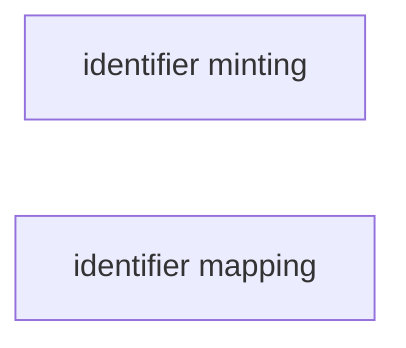

# Tools for identifier minting and identifier mapping.

# Main Objectives
This recipe identifies tools for creating identifiers and aligning identifiers used in different systems. 

>The lists of tools are generated either by manual curation, which reflects what is being used in the industry, or automatally discovered from the bio.tools repository.
>
>:bulb: Contents in this table are generated in March 2021. For updated contents, please check the FAIR tooling repository. You can provide feedback or report issues in the comments section.

# Graphical Overview of the FAIRification Recipe Objectives
The figure below shows different identifier-related operations and their relationships, together with related tools and recipes.

The table below is an overview of ontology strategies tools identified. Details of each tools are also provided in this doc.

<table>
  <tr>
   <td><strong>Identifier mapping</strong>
   </td>
  </tr>
  <tr>
   <td><a href="https://bio.tools/ah-db">ah-db</a>
   </td>
  </tr>
  <tr>
   <td><a href="https://bio.tools/bridgedb">bridgedb</a>
   </td>
  </tr>
  <tr>
   <td><a href="https://bio.tools/idmappinganalysis">idmappinganalysis</a>
   </td>
  </tr>
  <tr>
   <td><a href="https://bio.tools/idmappingretrieval">idmappingretrieval</a>
   </td>
  </tr>
  <tr>
   <td><a href="https://bio.tools/organism.dplyr">organism.dplyr</a>
   </td>
  </tr>
</table>
   
>Disclaimer: The tools list below aims to provide a idea of what is there on the market. It's not a formal recommendation. if you think there are tools that need to be updated, please contact us via the github issue.

## Operations

<h3 id=identifier-mapping>Identifier mapping</h3>
The process of mapping or translating identifiers from one database or system to another.

__Manually curated tools__ 
<table>
  <tr>
   <td><strong>Tool</strong>
   </td>
   <td><strong>Description</strong>
   </td>
   <td><strong>License</strong>
   </td>
   <td><strong>Topics</strong>
   </td>
   <td><strong>Resource type</strong>
   </td>
   <td><strong>Implementation Examples</strong>
   </td>
  </tr>
  <tr>
   <td>minid
   </td>
   <td>create a persistent, globally unique and resolvable identifier using the Minid client
   </td>
   <td>
   </td>
   <td>identifier generation
   </td>
   <td>
   </td>
   <td>
   </td>
  </tr>
  <tr>
   <td>groovy
   </td>
   <td>Generating InChI identifiers
   </td>
   <td>
   </td>
   <td>identifier generation,

Chemical data
   </td>
   <td>
   </td>
   <td>See complete recipe
   </td>
  </tr>
  <tr>
   <td><a href="http://purl.org/">purl.org</a>
   </td>
   <td>a service of the Internet Archive, which provides an interface to administer domain. For more information about the service, visit https://archive.org/services/purl/help
   </td>
   <td>
   </td>
   <td>identifier resolution
   </td>
   <td>
   </td>
   <td>
   </td>
  </tr>
  <tr>
   <td>CURIE
   </td>
   <td>defined by a World Wide Web Consortium Working Group Note CURIE Syntax 1.0, and provide a human readable shortening of IRIs.

The CURIE consists of a namespace prefix followed by the local identifier.
   </td>
   <td>
   </td>
   <td>identifier standards
   </td>
   <td>
   </td>
   <td>
   </td>
  </tr>
  <tr>
   <td>UUID
   </td>
   <td>A python package for generating UUID
   </td>
   <td>
   </td>
   <td>identifier generation
   </td>
   <td>python library
   </td>
   <td>import uuid

id = uuid.uuid4()

print(id)

5b6d0be2-d47f-11e8-9f9d-ccaf789d94a0
   </td>
  </tr>
  <tr>
   <td>hashlib
   </td>
   <td>A python package for generating hash-based identfier
   </td>
   <td>
   </td>
   <td>identifier generation
   </td>
   <td>python library
   </td>
   <td>A: curl https://fairplus.github.io/cookbook-dev/intro | b2sum --length 256 --binary

24d470987fda1278c63c3f97ab30869b821906449f3ecf290ee48086b8215668

B: import hashlib

# encode it to bytes using UTF-8 encoding

message = "creating globally unique identifiers for FAIR data".encode()

# hash with MD5 (not recommended)

print("MD5:", hashlib.md5(message).hexdigest())

# hash with SHA-2 (SHA-256 bits & SHA-512 bits long)

print("SHA-256:", hashlib.sha256(message).hexdigest())

print("SHA-512:", hashlib.sha512(message).hexdigest())

# hash with SHA-3

print("SHA-3-256:", hashlib.sha3_256(message).hexdigest())

print("SHA-3-512:", hashlib.sha3_512(message).hexdigest())

# hash with BLAKE2 (256-bits BLAKE2s & 512-bits BLAKE2c)

print("BLAKE2s:", hashlib.blake2s(message).hexdigest())

print("BLAKE2b:", hashlib.blake2b(message).hexdigest())
   </td>
  </tr>
  <tr>
   <td>bridgeDB
   </td>
   <td>a framework for identifier mapping within the life sciences which covers genes, proteins, genetic variants, metabolites, and metabolic reactions. It is provided as a web service, a standalone application that can be installed locally, a Java library or an R Package.
   </td>
   <td>
   </td>
   <td>Identifier mapping
   </td>
   <td>
   </td>
   <td>A: bridgeDB complete recipe

B: Retrieving equivalent identifiers for the EntrezGene ‘L’ identifier ‘1234’ for the Human gene CCR5

curl -X GET "https://webservice.bridgedb.org/Human/xrefs/L/1234" -H "accept: */*"
   </td>
  </tr>
  <tr>
   <td>UniChem
   </td>
   <td><a href="https://www.ebi.ac.uk/">a specialised identifier mapping service for chemical structures. For a chemical structure -- specified as an identifier, InChI, or InChI Key -- it will equivalent structures found in the EMBL-EBI</a> chemistry resources.
   </td>
   <td>
   </td>
   <td>Identifier mapping
   </td>
   <td>
   </td>
   <td><a href="https://www.ebi.ac.uk/chembl/compound_report_card/CHEMBL12/">Retrieves the equivalent database identifiers for the ChEMBL identifier CHEMBL12 DIAZEPAM</a> and returns the result as a JSON object

curl -X GET "https://www.ebi.ac.uk/unichem/rest/src_compound_id/CHEMBL12/1" -H "accept: */*"
   </td>
  </tr>
  <tr>
   <td><a href="https://sameas.org/">sameas.org</a>
   </td>
   <td>a general purpose service that will return a set of equivalent URLs for a given URL. The equivalences are based on an incomplete set of owl:sameAs statements contained in data available on the web.
   </td>
   <td>
   </td>
   <td>Identifier mapping
   </td>
   <td>
   </td>
   <td><a href="https://rdf.ebi.ac.uk/resource/chembl/molecule/CHEMBL12">retrieves the equivalent URLs for EBI RDF Platform representation of ChEMBL DIAZEPAM</a> as a JSON object.

curl -iLH "Accept: application/json" "http://sameas.org/?uri=http://rdf.ebi.ac.uk/resource/chembl/molecule/CHEMBL12"
   </td>
  </tr>
  <tr>
   <td>Name2Things
   </td>
   <td>a Resolution Service, maintained at the California Digital Library (CDL) within the University of California (UC) Office of the President.
   </td>
   <td>
   </td>
   <td>identifier resolution
   </td>
   <td>
   </td>
   <td>
   </td>
  </tr>
  <tr>
   <td>w3ids
   </td>
   <td>Permanent Identifiers for the Web. Secure, permanent URLs for your Web application that will stand the test of time.
   </td>
   <td>
   </td>
   <td>identifier standards
   </td>
   <td>
   </td>
   <td>
   </td>
  </tr>
  <tr>
   <td><a href="http://identifier.org/">identifier.org</a>
   </td>
   <td>a Resolution Service that provides access to alternative mirrors of the same database which are located at different URLs on the web. For example, the UniProt database is based as the Swiss Institute of Bioinformatics but is also mirrored on the NCBI in the States.
   </td>
   <td>
   </td>
   <td>
   </td>
   <td>
   </td>
   <td>N/A
   </td>
  </tr>
</table>

__Tools discovered from [Bio.Tools](https://bio.tools).__
<table>
  <tr>
   <td><strong>Tool</strong>
   </td>
   <td><strong>Description</strong>
   </td>
   <td><strong>License</strong>
   </td>
   <td><strong>Topics</strong>
   </td>
   <td><strong>ResourceType</strong>
   </td>
  </tr>
  <tr>
   <td><a href="https://bio.tools/ah-db">ah-db</a>
   </td>
   <td>Database of protein structure pairs (apo-holo structure pairs) before and after binding. AH-DB is designed to provide an easy and unified way to prepare apo-holo structure pair data for studies. Data is generated by identifying/mapping molecules in Protein Data Bank (PDB) entries.
   </td>
   <td>
   </td>
   <td>Protein structure analysis, Experimental design and studies, Structure prediction, Proteins, Mapping
   </td>
   <td>Database portal
   </td>
  </tr>
  <tr>
   <td><a href="https://bio.tools/bridgedb">bridgedb</a>
   </td>
   <td>BridgeDb is a framework to map identifiers between various databases. It includes a Java library that provides an API to work with identifier-identifier mapping databases and resources.
   </td>
   <td><a href="https://spdx.org/licenses/Apache-2.0">Apache-2.0</a>
   </td>
   <td>Metabolomics, Rare diseases, Genomics, Proteomics
   </td>
   <td>Library, Web API, Command line tool
   </td>
  </tr>
  <tr>
   <td><a href="https://bio.tools/idmappinganalysis">idmappinganalysis</a>
   </td>
   <td>Identifier mapping performance analysis.
   </td>
   <td><a href="https://spdx.org/licenses/GPL-2.0">GPL-2.0</a>
   </td>
   <td>
   </td>
   <td>
   </td>
  </tr>
  <tr>
   <td><a href="https://bio.tools/idmappingretrieval">idmappingretrieval</a>
   </td>
   <td>Data retrieval for identifier mapping performance analysis.
   </td>
   <td><a href="https://spdx.org/licenses/GPL-2.0">GPL-2.0</a>
   </td>
   <td>Biology, Bioinformatics
   </td>
   <td>Command-line tool, Library
   </td>
  </tr>
  <tr>
   <td><a href="https://bio.tools/organism.dplyr">organism.dplyr</a>
   </td>
   <td>This package provides an alternative interface to Bioconductor annotation resources, in particular the gene identifier mapping functionality of the org packages (e.g., org.Hs.eg.db) and the genome coordinate functionality of the TxDb packages
   </td>
   <td><a href="https://spdx.org/licenses/Artistic-2.0">Artistic-2.0</a>
   </td>
   <td>Sequencing
   </td>
   <td>Library
   </td>
  </tr>
</table>

### Example use case: 
To show how these tools can be used in real life examples, please check the related recipes.

## Authors
|Name|Affiliation|ORCID|Credit role|
|---|--|--|--|
|Fuqi Xu|EMBL-EBI|0000-0002-5923-3859|Original draft|
|Eva Martin|BSC|0000-0001-8324-2897|Original draft
|Sukhi Singh|||Tool curation|

# References: 
1. https://en.wikipedia.org/wiki/Extract,_transform,_load

