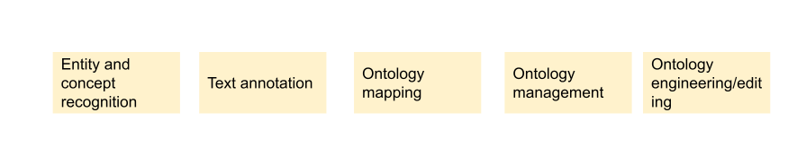
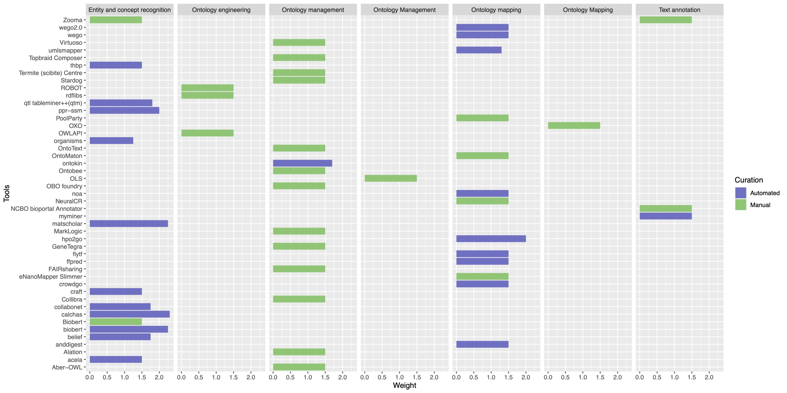

# Ontology annotation tools

⚠️ WIP

## Definition
- Linking free text, token to their semantic annotation. For example, Suggested ontology terms need to be provided to experimenters who have no experience in using ontologies to describe data
- to increase the findability of unstrctured text by easy automating the process of semantic annotation. Switching from token based annotation to ontology-based annotation.

## Example FAIRplus use case and process
- Suggested ontology terms need to be provided to experimenters who have no experience in using ontologies to describe data

## Tools 
Overview: __To Be updated, please use information listed in text below instead__  

The complete list is in FAIRplus drive: [here](https://drive.google.com/drive/u/2/folders/1l92AazXtBA1aUg-66utB3UKyY00MgLLH)
For autodetected tools, please check [here](https://github.com/FAIRplus/WP3_FAIR_tooling/tree/main/tool_discovery/outputs/ontology).

#### Entity and concept recognition
Linking free text, token to their semantic annotation. For example, Suggested ontology terms need to be provided to experimenters who have no experience in using ontologies to describe data. to increase the findability of unstrctured text by easy automating the process of semantic annotation, and switch from token based annotation to ontology-based annotation.
- [ZOOMA](https://www.ebi.ac.uk/spot/zooma/), A tool for mapping free text annotations to ontology term based on a curated repository of annotation knowledge
	📄 License: [EMBL-EBI Terms of Use](https://www.ebi.ac.uk/about/terms-of-use/)
	🛠️ Interface: GUI and API
- [NCBI BioPortal Annotator](https://bioportal.bioontology.org/annotatorplus) Get annotations for biomedical text with classes from the ontologies.
	📄 License: [NioPortal Terms of Use](https://www.ebi.ac.uk/about/terms-of-use/)
	🛠️ Interface: GUI and API
- [BioBert](https://github.com/dmis-lab/biobert) A biomedical language representation model designed for biomedical text mining tasks such as biomedical named entity recognition, relation extraction, question answering.
	📄 License: Apache 2.0
- [Termite](https://www.scibite.com/platform/termite/) semantic enrichment to unlock the value of unstructured text and simplify the identification of new potential biomarker leads from scientific text.
	📄 License: Commercial tool
- [PoolParty](https://www.poolparty.biz/)  Automate the handling of heterogeneous metadata systems and the creation of enterprise knowledge graphs.design knowledge graphs at your own pace and with speed. Create your own ontologies and custom schemes by reusing already existing ontologies such as FOAF, FIBO, schema.org and CHEBI, among others. Apply them to your existing taxonomies with ease.
	📄 License: Commercial tool
	

-----

#### Ontology mapping
Ontology-based annotated datasets need to be integrated. The datasets has been annotated using different ontologies. Determining correspondences between concepts in ontologies. Given a set of ontologies, return their alignments. i.e. cross-references among the concepts depicted by each ontology.

- [OxO](https://www.ebi.ac.uk/spot/oxo/index) a service for finding mappings (or cross-references) between terms from ontologies, vocabularies and coding standards. OxO imports mappings from a variety of sources including the Ontology Lookup Service and a subset of mappings provided by the UMLS. We're still developing the service so please get in touch if you have any feedback.
	📄 License: [EMBL-EBI Terms of Use](https://www.ebi.ac.uk/about/terms-of-use/)
	🛠️ Interface: GUI and API
- [BioBert](https://github.com/dmis-lab/biobert) A biomedical language representation model designed for biomedical text mining tasks such as biomedical named entity recognition, relation extraction, question answering.
	📄 License: Apache 2.0
#### Ontology Engineering
“the set of activities that concern the ontology development process, the ontology life cycle, and the methodologies, tools and languages for building ontologies”[1]

- Protege
- [ROBOT](http://robot.obolibrary.org/). An open source library and command-line tool for automating ontology development tasks. ROBOT provides ontology processing commands for a variety of tasks, including commands for converting formats, running a reasoner, creating import modules, running reports, and various other tasks.
	📄 License: BSD 3-Clause License
	🛠️ Interface: CLI
- [OWLAPI](http://owlcs.github.io/owlapi/)  A Java API and reference implmentation for creating, manipulating and serialising OWL Ontologies
	📄 License:  LGPL and Apache
	🛠️ Interface: API
- eNanoMapper Slimmer
-------
#### Ontology management
The management of knowledge, vocabulory and ontologies.

- [OLS](https://www.ebi.ac.uk/ols/index) a repository for biomedical ontologies that aims to provide a single point of access to the latest ontology versions.
	📄 License: [EMBL-EBI Terms of Use](https://www.ebi.ac.uk/about/terms-of-use/)
	🛠️ Interface: GUI and API
- [BioPortal](https://bioportal.bioontology.org/) A repository of biomedical ontologies
	📄 License: [NioPortal Terms of Use](https://www.ebi.ac.uk/about/terms-of-use/)
	🛠️ Interface: GUI and API
- [PoolParty](https://www.poolparty.biz/)  Automate the handling of heterogeneous metadata systems and the creation of enterprise knowledge graphs.design knowledge graphs at your own pace and with speed. Create your own ontologies and custom schemes by reusing already existing ontologies such as FOAF, FIBO, schema.org and CHEBI, among others. Apply them to your existing taxonomies with ease.
	📄 License: Commercial tool
- [Centree Ontology Manager](https://www.scibite.com/platform/centree/)
a centralised, enterprise-ready resource for ontology management and transforms the experience of maintaining and releasing ontologies for research-led businesses. 
	📄 License: Commercial tool

### Reference:
[1] https://info.sice.indiana.edu/~dingying/Teaching/S604/GeneralOntology.pdf

